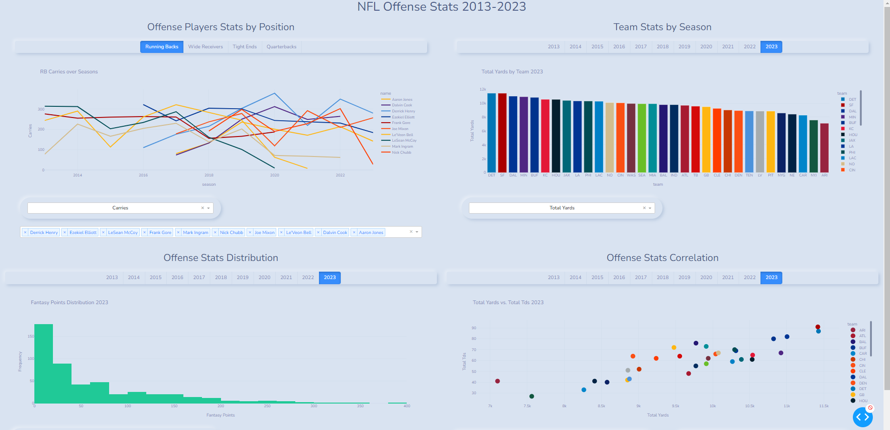

# NFL Offense Stats Dashboard



This project is a Dash application that visualizes Immune health data

## Features

- **Compare Protiens to cells

## Installation

### Prerequisites

- Python 3

### Steps

1. **Clone the repository:**

   ```bash
   git clone https://github.com/Alfredomg7/NFLOffenseStatsDashboard.git
   cd NFLOffenseStatsDashboard
   ```

2. **Install the dependencies:**
   
   ```bash
   pip install -r requirements.txt
   ```

3. **Run the dash web application:**

   ```bash
   python app.py
   ```

## Project Structure
- `app.py`: Main application module containing the Dash app setup and layout.
- `utilities.py`: Utility functions for data loading, formatting, and creating callbacks.
- `config.py`: Configuration module with lists of statistics and team colors.
- `data/offense_yearly_data.csv`: Dataset with NFL Offense Stats used for the dashboard.

## Usage
- Run the application and open your browser to `http://127.0.0.1:8050`.
- Use the tabs and dropdowns to explore different player and team statistics.

## Acknowledgements
- Dash by Plotly: https://dash.plotly.com/
- Bootstrap Components: https://dash-bootstrap-components.opensource.faculty.ai/

## License
This project is for personal portfolio use and is not intended for commercial distribution. Feel free to explore and learn from the code, but please contact me if you wish to use it for other purposes.

